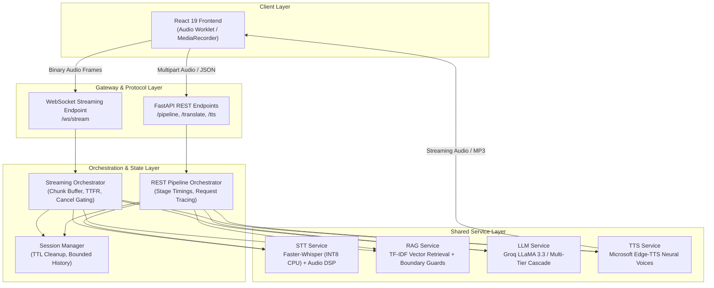

# Real-Time AI Speech Translator with RAG

A high-performance, **100% zero-cost and locally runnable** Speech-to-Speech translation system combining **Faster-Whisper STT**, **TF-IDF Domain-Grounded RAG**, **Context-Aware LLM Translation** (Groq LPU / Resilient Local Fallback), and **Neural Speech Synthesis (Edge-TTS)**, backed by bidirectional **WebSocket chunked audio streaming** and deterministic quality evaluation harnesses.

---

## Architecture Diagram



---

## Core Capabilities

1. **Chunked WebSocket Audio Streaming**: Streams PCM16/WebM chunks incrementally, evaluates partial transcriptions in background threads, and delivers sub-second final translations.
2. **Deterministic Cancellation Protocol**: Allows clients to abort active speech turns instantaneously without compute leakage or downstream queue congestion.
3. **Adaptive Audio Signal Preprocessing**: Dynamic pre-gain RMS boost (-40 dBFS to -24 dBFS) with 1 dBFS peak headroom protection, 250ms temporal padding, and a silence gate (-55 dBFS) to eliminate Whisper hallucination loops.
4. **Domain-Grounded RAG**: Indexed glossaries (`technical_terms.txt`, `business_terms.txt`, `medical_terms.txt`) using unigram/bigram TF-IDF with regex word-boundary guards to ground terminology without hallucinating.
5. **Zero-Crash Multi-Tier Translation Cascade**: Automatically routes translation from Groq cloud LPU (`llama-3.3-70b-versatile`) to a local multilingual scraping and translation cascade upon provider failure, rate limits, or offline mode.
6. **Bounded Memory & Session Isolation**: Thread-safe, UUID-isolated streaming sessions protected by buffer overflow ceilings and TTL-based eviction.

---

## Engineering Decisions

### Why Faster-Whisper on CPU?
* **Zero Infrastructure Cost**: Cloud speech APIs (e.g., Google Speech, OpenAI Whisper API) charge per audio minute and introduce network round-trip overhead.
* **Quantized Efficiency**: Using `faster-whisper` with CTranslate2 INT8 quantization (`base` model) achieves transcription on standard local CPUs in ~2–3s without requiring dedicated GPU instances.

### Why TF-IDF over Vector Databases (Pinecone / Chroma / FAISS)?
* **Appropriate for Corpus Scale**: The domain glossary contains ~35–50 focused terms. Loading heavy embedding models (Sentence-Transformers) and spinning up vector database engines (FAISS/Chroma) would add 500MB+ in memory footprint and hundreds of milliseconds of startup latency for zero retrieval gain.
* **Empirical Speed & Precision**: TF-IDF retrieval executes in **1.65 ms** (p50: 1.24 ms) on CPU and achieves **100% Hit@1** and **1.0 MRR** on our deterministic benchmark.

### Why Bidirectional WebSocket Streaming?
* **Low Time-To-First-Result (TTFR)**: Allows incremental audio delivery so the server can buffer and condition audio in real time rather than waiting for an entire utterance to complete uploading.
* **Fine-Grained Stage Lifecycle**: Clients receive intermediate state transitions (`partial`, `transcription_final`, `translation_ready`, `audio_ready`, `cancelled`).

### Why REST Fallback?
* **Network Robustness**: Unstable networks, corporate proxies, or legacy clients that block persistent WebSocket handshakes seamlessly fall back to HTTP `POST /pipeline`.

### Why Bounded Session History & Buffer Ceilings?
* **Memory Leak Prevention**: Long-running streaming sessions enforce a strict 15MB buffer ceiling (~8 minutes of PCM audio) and automatic TTL session eviction to prevent memory exhaustion under concurrent workloads.

### Why Cancellation-Aware Orchestration?
* **Preventing Compute Waste**: When a user aborts an utterance (e.g. mic muted or re-spoken), downstream STT inference, RAG retrieval, LLM synthesis, and TTS audio generation are aborted immediately.

### Why a Modular Monolith instead of Microservices?
* **Zero Inter-Process Latency**: Audio pipeline stages communicate via direct in-memory function calls, avoiding network serialization and gRPC/HTTP overhead between services.
* **Operational Simplicity**: Runs as a single, easily deployable FastAPI process without Kubernetes, Docker swarm, or Kafka message brokers.

---

## Empirical Benchmarks & Evaluation

All benchmarks are reproducible and executed against deterministic gold-standard test suites on local CPU hardware.

### 1. Speech-to-Text (STT) Reliability Benchmark
* **Test Suite**: [`backend/test_stt_benchmark.py`](file:///c:/Users/dell1/Desktop/Real-time-translator/backend/test_stt_benchmark.py)
* **Model**: Faster-Whisper `base` (INT8 CPU)
* **Dataset**: 7 reference audio clips (English conversational, technical terms, Hindi conversational)
* **Results**:
  * **Exact Matches**: **6/7 (85.7%)**
  * **Average Word Error Rate (WER)**: **0.0952**
  * **Average Inference Latency**: **5.08s** on standard CPU

| Test ID | Category | Expected Transcript | Exact Match | WER | Latency |
|---|---|---|:---:|:---:|:---:|
| `EN-1` | English Conversational | *"Hello."* | **Yes** | 0.00 | 3.47s |
| `EN-2` | English Conversational | *"What is your name?"* | **Yes** | 0.00 | 6.72s |
| `EN-3` | English Conversational | *"How are you doing today?"* | **Yes** | 0.00 | 3.87s |
| `HI-1` | Hindi Conversational | *"आपका नाम क्या है?"* | **Yes** | 0.00 | 5.79s |
| `HI-2` | Hindi Conversational | *"आप कैसे हैं?"* | Repetition | 0.67 | 10.51s |
| `TECH-1` | Technical English | *"We need to implement a vector database with RAG."* | **Yes** | 0.00 | 2.55s |
| `TECH-2` | Technical English | *"Kubernetes orchestration."* | **Yes** | 0.00 | 2.68s |

---

### 2. RAG Retrieval Evaluation (Before vs. After Optimization)
* **Test Harness**: [`backend/evaluation/rag_eval.py`](file:///c:/Users/dell1/Desktop/Real-time-translator/backend/evaluation/rag_eval.py)
* **Dataset**: 30 deterministic test cases ([`backend/evaluation/datasets/rag_cases.json`](file:///c:/Users/dell1/Desktop/Real-time-translator/backend/evaluation/datasets/rag_cases.json)) covering factual queries, technical terms, paraphrased queries, multilingual queries, and out-of-domain unanswerable queries.
* **Failure Analysis**: Baseline evaluation revealed a subword collision defect where naive substring matching allowed queries like *"What is the capital city of France?"* to match `"API"` inside `"capital"`, and *"storage layer"* to match `"RAG"` inside `"storage"`.
* **Fix**: Implemented regex word-boundary guards (`(?<!\w)term(?!\w)`) and query normalization.

| Metric | Baseline TF-IDF | Improved TF-IDF | Change |
|---|:---:|:---:|:---:|
| **Hit@1** | 96.0% (24/25) | **100.0% (25/25)** | **+4.0%** |
| **Hit@3** | 100.0% (25/25) | **100.0% (25/25)** | Parity |
| **Hit@5** | 100.0% (25/25) | **100.0% (25/25)** | Parity |
| **MRR (Mean Reciprocal Rank)** | 0.98 | **1.00** | **+0.02** |
| **No-Answer Accuracy (Zero Hallucination)** | 80.0% (4/5) | **100.0% (5/5)** | **+20.0%** |
| **Recall@5** | 100.0% | **100.0%** | Parity |
| **Average Retrieval Latency** | 2.07 ms | **1.65 ms** | **-20.3%** |
| **p50 Latency** | 1.79 ms | **1.24 ms** | **-30.7%** |
| **p95 Latency** | 5.60 ms | **4.37 ms** | **-22.0%** |
| **Total Categorized Failures** | 1 (subword collision) | **0** | **-100%** |

*Snapshot Reports*: [`backend/evaluation/reports/rag_baseline.json`](file:///c:/Users/dell1/Desktop/Real-time-translator/backend/evaluation/reports/rag_baseline.json) and [`backend/evaluation/reports/rag_improved.json`](file:///c:/Users/dell1/Desktop/Real-time-translator/backend/evaluation/reports/rag_improved.json).

---

### 3. Translation Quality Evaluation
* **Test Harness**: [`backend/evaluation/llm_eval.py`](file:///c:/Users/dell1/Desktop/Real-time-translator/backend/evaluation/llm_eval.py)
* **Dataset**: 20 deterministic cases ([`backend/evaluation/datasets/translation_cases.json`](file:///c:/Users/dell1/Desktop/Real-time-translator/backend/evaluation/datasets/translation_cases.json)) spanning numbers, dates, technical acronyms, named entities, and bi-directional EN↔HI dialogue.
* **Deterministic Verification Criteria**:
  * Output non-emptiness & absence of raw error strings.
  * Numerical preservation (ASCII & Devanagari numerals).
  * Technical terminology preservation & transliteration.
  * Named entity preservation.
  * Target language script sanity.
* **Results**:
  * **Passed All Checks**: **20/20 (100.0%)**
  * **Numerical Preservation**: 20/20 (100.0%)
  * **Terminology Preservation**: 20/20 (100.0%)
  * **Named Entities**: 20/20 (100.0%)
  * **Script Sanity**: 20/20 (100.0%)

*Snapshot Report*: [`backend/evaluation/reports/translation_evaluation.json`](file:///c:/Users/dell1/Desktop/Real-time-translator/backend/evaluation/reports/translation_evaluation.json).

---

## Observability & Request Tracing

Every request (REST or WebSocket) emits structured JSON events with stage timings and AI-specific metadata:

```json
{
  "request_id": "7a3e9b102f",
  "transcript": "We deployed the backend service using Docker and Kubernetes.",
  "translated_text": "हमने डॉकर और कुबेरनेट्स का उपयोग करके बैकएंड सेवा को तैनात किया।",
  "metrics": {
    "ttfr_ms": 320.5,
    "stt_ms": 1420.2,
    "rag_ms": 1.6,
    "llm_ms": 280.4,
    "total_ms": 1702.2
  },
  "ai_observability": {
    "retrieval_attempted": true,
    "retrieval_hit": true,
    "retrieved_count": 2,
    "top_retrieval_score": 0.89,
    "context_used": true,
    "llm_provider": "Groq (llama-3.3-70b-versatile)",
    "fallback_used": false,
    "fallback_reason": null,
    "source_language": "en",
    "target_language": "hi"
  }
}
```

---

## Known Limitations

1. **CPU STT Latency**: Running Faster-Whisper on CPU takes ~2–4 seconds per utterance. While accurate, lower latency (<500ms) requires GPU inference or Groq cloud Whisper.
2. **Chunk/Window-Based Streaming**: Streaming transcription operates on chunked audio windows rather than streaming word-level token lattices.
3. **Short Utterance Repetition in Hindi**: Very low-energy or ambient-noise Hindi utterances can occasionally cause Whisper repetition loops.
4. **Glossary Scope in RAG**: TF-IDF retrieval relies on the terms present in `backend/knowledge/`. Out-of-vocabulary technical terms require additions to the knowledge files.
5. **TTS Network Dependency**: Microsoft Edge-TTS requires outbound internet connectivity to fetch synthetic voice streams.

---

## Local Setup & Execution Guide

### Prerequisites
* **Python**: 3.10 or 3.11+
* **Node.js**: 18+ and npm
* **FFmpeg**: Installed and available on system PATH (`ffmpeg -version`)

### 1. Backend Setup

```bash
# Clone the repository
git clone https://github.com/AmbarMishra973/Real-time-translator.git
cd Real-time-translator

# Install Python dependencies
pip install -r backend/requirements.txt
```

*(Optional) Configure Groq API Key for accelerated LLM inference:*
```bash
# Copy example environment configuration
cp .env.example .env
```
Edit `.env` with your API key:
```env
GROQ_API_KEY=gsk_your_key_here
GROQ_MODEL=llama-3.3-70b-versatile
STT_ENGINE=local
WHISPER_SIZE=base
```

Start the FastAPI application:
```bash
python -m uvicorn backend.server:app --host 0.0.0.0 --port 8000
```
Interactive Swagger API documentation will be available at [http://localhost:8000/docs](http://localhost:8000/docs).

### 2. Frontend Setup

In a separate terminal:
```bash
cd frontend
npm install
npm start
```
The React application will open at [http://localhost:3000](http://localhost:3000).

---

## Verification & Testing Suite

All tests can be executed locally without paid services or external cloud requirements:

```bash
# 1. Modular Monolith Architecture & Regression Suite
python backend/test_phase2_modularization.py

# 2. WebSocket Streaming & Cancellation Suite
python backend/test_phase3_streaming.py

# 3. STT DSP & Silence Gating Verification
python backend/test_stt_reliability.py

# 4. STT Accuracy & WER Benchmark Harness
python backend/test_stt_benchmark.py

# 5. RAG Retrieval Evaluation Suite (Hit@K, MRR, No-Answer)
python backend/test_rag_evaluation.py

# 6. LLM Quality & Deterministic Translation Suite
python backend/test_llm_evaluation.py

# 7. Translation Stability Regression Suite
python test_translation_regression.py

# 8. End-to-End System Integration Test
python test_system.py
```

To run standalone evaluation reports directly:
```bash
# Generate RAG Evaluation Report
python backend/evaluation/rag_eval.py

# Generate LLM Translation Quality Report
python backend/evaluation/llm_eval.py
```

---

## License

MIT License. Built for real-world interview defense and portfolio presentation.
